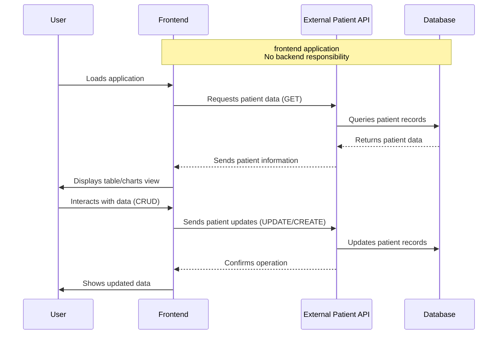

# Patient App

A **frontend** healthcare patient management web application with real-time data visualization and comprehensive patient monitoring capabilities, connecting to an external patient API.

### Tech Stack

- **Framework:** React 19 with Vite
- **Language:** TypeScript
- **Navigation:** Single Page Application (SPA)
- **State Management:** React Hooks with custom usePatient hook
- **Forms & Validation:** React Hook Form + Zod
- **HTTP Client:** Axios with custom request wrapper
- **Styling:** Tailwind CSS v4 with custom components
- **Storage:** Local Storage for theme preferences
- **Key Libraries/Services:** Recharts for data visualization, Radix UI for components, Lucide React for icons

<div align="center" style="display: inline_block justify-center"><br>
   </div>

## 🚀 Main Features

- **Patient Data Management** - Read, create, and update operations for patient records via external API
- **Interactive Data Visualization** - Real-time charts and metrics dashboard
- **Parameter Monitoring** - Track vital signs and alarm detection (mocked data)
- **Dual View Interface** - Switch between table and chart views seamlessly
- **Dark/Light Theme** - User preference with system detection
- **Responsive Design** - Mobile-first approach for all devices
- **Recent Activity** - Mocked activity data with potential for real-time implementation

## 📊 Core Application Flow

**This is a new, required section.** Create a Mermaid diagram that illustrates the most important flow of the application (e.g., user uploads something, it gets processed by the backend/AI, and the result is returned).



## 🌐 Live Demo

Check out the live application in production: **[Patient App](https://patient-app-eight.vercel.app/)**

## ⚡ How to Run Locally

1. Clone the repository:
   ```bash
   git clone https://github.com/giacomosalsano/patient-app.git cd patient-app
   ```
2. Install dependencies:
   ```bash
   npm install
   ```
3. Create environment variables:
   ```bash
   # Create .env file with:
   VITE_API_BASE_URL=api_url
   VITE_API_USER=api_username
   VITE_API_PASS=api_password
   ```
4. Start the development server:
   ```bash
   npm run dev
   ```

## 📚 Learn More

For full details on architecture, features, components, and improvement suggestions, please see the [complete documentation](./documentation.md).

---

made with ♥ by [giacomosalsano](https://giacomosalsano.com)!
